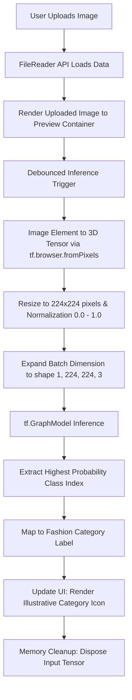

# 👕 Fashion MNIST Classifier

[](https://js.tensorflow.org/)
[](https://tailwindcss.com/)
[](https://jquery.com/)

An ultra-sleek, privacy-first, zero-server-cost **Fashion MNIST Classifier** running entirely client-side in the browser. Powered by **TensorFlow.js** and styled with **Tailwind CSS v4**, this application uses a deep convolutional graph model (transfer-learned for high-dimensional inference) to classify uploaded clothing items in real-time.

---

## 🎯 The Purpose & Goal

### The Why
Traditional machine learning pipelines rely on heavy, expensive backend servers (Python/Flask/FastAPI, PyTorch/TensorFlow) to host deep learning models and run inference. This introduces server maintenance costs, latency bottlenecks, and significant user-privacy concerns since photos must be uploaded to external servers.

**Fashion MNIST Classifier** solves this by shifting **100% of the computation to the client's GPU/CPU** via browser-native WebGL-accelerated environments using TensorFlow.js.
* **🔒 Absolute Privacy:** Images never leave the user's machine.
* **💸 Zero Server Costs:** The app can be hosted for free on GitHub Pages, Vercel, or Netlify, scaling to millions of users at no cost.
* **⚡ Instant Response:** Local inference eliminates API roundtrip network latency.

### The Goal
To deliver an elegant, interactive, gamified web interface where users can drag, drop, or upload images of apparel and instantly receive a visual, high-fidelity classification corresponding to the 10 standard categories of the standard Fashion MNIST dataset:

| Index | Category | Index | Category |
| :---: | :--- | :---: | :--- |
| **0** | T-shirt/top | **5** | Sandal |
| **1** | Trouser | **6** | Shirt |
| **2** | Pullover | **7** | Sneaker |
| **3** | Dress | **8** | Bag |
| **4** | Coat | **9** | Ankle boot |

---

## 🏗️ System Architecture

The application is built on a modular client-side stack leveraging a single-page reactive layout.

### 📐 Structural Workflow


---

## 💻 The How (Implementation Details)

### 1. Model Loading & Ingestion
The system loads a pre-trained deep learning model saved in the TF.js graph format. It uses split shards to facilitate fast, concurrent browser asset loading and caching.

```javascript
async function loadModel() {
    try {
        const loadedModel = await tf.loadGraphModel('models/model.json');
        console.log('Model loaded successfully');
        return loadedModel;
    } catch (error) {
        console.error('Error loading model:', error);
        return null;
    }
}
```

### 2. High-Dimensional Image Preprocessing
While the standard Fashion MNIST dataset is based on $28\times28$ grayscale matrices, this system leverages a transfer-learned model trained on high-dimensional feature spaces ($224\times224\times3$ RGB). This allows users to upload standard colored smartphone photos directly without manually downscaling or grayscaling.

```javascript
function preprocessImage(imageElement) {
    const tensor = tf.browser.fromPixels(imageElement)
        .resizeNearestNeighbor([224, 224])
        .toFloat()
        .div(tf.scalar(255.0))
        .expandDims(); // Add batch dimension [1, 224, 224, 3]
    return tensor;
}
```

### 3. Client-Side Memory Optimization
In browser deep learning environments, leaving tensors uncollected in memory will quickly exhaust GPU VRAM or system RAM, causing page crashes. The app enforces strict memory hygiene by explicitly disposing of the created tensors immediately after inference.

```javascript
const tensor = preprocessImage(imageElement);
const predictions = await model.predict(tensor).data();
...
// Dispose of the tensor to prevent memory leaks
tensor.dispose();
```

### 4. Adaptive Input Debouncing
To prevent duplicate inference passes and UI stutters when users click rapidly or swap files, predictions are debounced using a high-performance utility:

```javascript
function debounce(func, delay) {
    let timeout;
    return function(...args) {
        const context = this;
        clearTimeout(timeout);
        timeout = setTimeout(() => func.apply(context, args), delay);
    };
}
const debouncedPredict = debounce(predict, 500);
```

---

## 🎨 UI/UX Design System

The application boasts a premium, high-fidelity visual design, moving away from dull, generic AI project layouts.

* **DM Sans Typography:** Clean, modern geometric sans-serif typeface sourced from Google Fonts.
* **Warm & Vibrant Accents:** Styled using Tailwind CSS v4 featuring playful pink (`#df6592`) and yellow (`#ffc736`) highlights.
* **Sleek Skeuomorphism:** Rich upload frame overlays (`img/upload-frame.png`) that wrap the preview image smoothly.
* **Fluid Micro-Animations:** Dynamic transitions when elements are hovered, transforming colors and scaling SVGs to enhance engagement.
* **Visual Output Feedback:** Instead of printing a raw text label, the app dynamically replaces the class illustration (`img/classes/{predictedClassName}.png`) to reveal a corresponding graphic, gamifying the user feedback loop.

---

## 🚀 Getting Started

Since TensorFlow.js requires HTTP/HTTPS protocols to load the model file JSON and binary shards (`models/model.json` / `models/*.bin`) due to browser CORS security restrictions, you cannot open `index.html` directly from the filesystem (`file://`).

You must run the project using a local HTTP server.

### Option A: Using Visual Studio Code (Live Server)
1. Install the **Live Server** extension in VS Code.
2. Open the project folder.
3. Click the **"Go Live"** button on the bottom right status bar.

### Option B: Using Node.js (npx)
If you have Node.js installed, execute this command inside the project directory:
```bash
# Serve the current directory on http://localhost:3000
npx serve .
```
Or use the Python built-in server:
```bash
# Python 3
python3 -m http.server 8000
```

---

## 📂 File Directory Structure

```bash
Fashion-MNIST-Classifier/
├── index.html          # Core HTML5 layout with Tailwind CSS v4 CDN
├── index.js            # TensorFlow.js image processing, inference, and event logic
├── models/             # Pre-trained deep learning graph model
│   ├── model.json      # Model structure and weight specifications
│   ├── group1-shard1of3.bin
│   ├── group1-shard2of3.bin
│   └── group1-shard3of3.bin
└── img/                # UI Assets and illustrations
    ├── logo.png        # Application Brand Logo
    ├── bg.png          # Elegant textured background image
    ├── upload-frame.png# Skeuomorphic overlay for upload area
    └── classes/        # Category illustrations
        ├── ankle-boot.png
        ├── bag.png
        ├── coat.png
        └── ... (other clothing category PNGs)
```

---

Presented with ❤️ by **Simon Says**.
